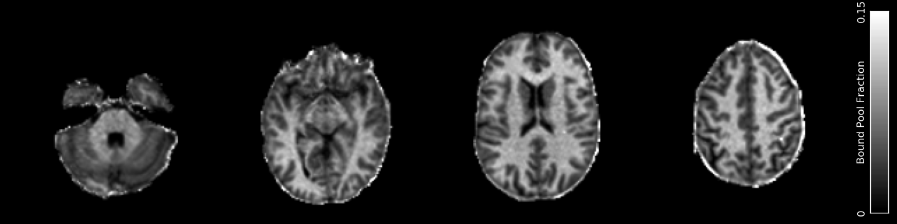

Magnetization Transfer
======================

MR voxels often contain complex microstructure with multiple different components or pools, each with unique relaxation properties. It is possible for magnetization to be transferred between these pools via several mechanisms, such as exchange of individual protons or entire molecules, or simple dipolar coupling from molecules that are in close proximity. These mechanisms can be studied in the related fields of Magnetization Transfer (MT) and Chemical Exchange Saturation Transfer (CEST). QUIT currently contains some basic CEST analysis tools and one for calculating simple dipolar/inhomogeneous MT ratios.

In addition a tool is provided for calculating qMT parameters from SSFP data. This is in the :Doc:`SSFP` module.

* `qi_lineshape`_
* `qi_qmt`_
* `qi_zspec_interp`_
* `qi_lorentzian`_
* `qi_dipolar_mtr.sh`_

qi_lineshape
------------

A utility to sample lineshapes and write them out to files, which can then be read by `qi_qmt`_ and interpolated values used instead of calculating the lineshape during fitting. This is used principally to speed up fitting the Super-Lorentzian lineshape, which takes a long time to calculate but is smoothly valued, so can be accurately approximated using interpolation.

**Example Command Line**

.. code-block:: bash

    qi_lineshape --lineshape=SuperLorentzian --frq_start=500 --frq_space=500 --frq_count=150 > superlorentz.json

No input file required. Output is to ``stdout`` in JSON format, so should be redirected into a file for further use.

**Important Options**

* ``--lineshape, -l``

    Choose from a Gaussian, a Lorentzian or the Super-Lorentzian

* ``--T2b, -t``

    Specify the nominal T2 of the lineshape. During fitting in `qi_qmt`_ scaling will be used to find the actual value. Should be specified in seconds.

* ``--frq_count``, ``--frq_start``, ``--frq_space``

    These Control the position and number of samples to take on the lineshape. ``frq_start`` and ``frq_space`` should be in Hertz.

qi_qmt
------

Calculates Quantitative Magnetization Transfer parameters using the Ramani model from steady-state gradient-echo data acquired with multiple off-resonance saturation pulses.

**Example Command Line**

.. code-block:: bash

    qi_qmt --verbose MTSatData.nii.gz T1.nii.gz --mask brain_mask.nii.gz --lineshape=superlorentz.json --B1=B1_map.nii.gz --f0=B0_map.nii.gz < input.json

Note that a T1 map is a required input to stabilise the fitting.

**Example JSON File**

.. code-block:: json

    {
        "MTSat" : {
            "TR": 0.055,
            "FA": 5,
            "sat_f0": [56360, 47180, 12060, 1000, 1000, 2750, 2770, 2790, 2890, 1000, 1000],
            "sat_angle": [332, 628, 628, 332, 333, 628, 628, 628, 628, 628, 628],
            "pulse": { "name": "Gauss", "Trf": 0.015, "p1": 0.416, "p2": 0.295 }
        }
    }

``Trf`` is the pulse-width (RF Time). ``p1`` and ``p2`` are the ratio of the integral of :math:`B_1` and :math:`B_1^2` (the integrals of the pulse amplitude and the square of the pulse amplitude) to the maximum amplitude of the pulse. Both ``Trf`` and ``TR`` should be in seconds. ``sat_f0`` is in Hertz.

**Outputs**

- ``QMT_f_b.nii.gz`` - The bound pool fraction
- ``QMT_k_bf.nii.gz`` - The forward exchange rate from bound to free pool
- ``QMT_T1_f.nii.gz`` - T1 of the free pool
- ``QMT_T2_f.nii.gz`` - T2 of the free pool
- ``QMT_T2_b.nii.gz`` - T2 of the bound pool
- ``QMT_PD.nii.gz`` - The apparent Proton Density / size of the free pool

Note that ``T1_b``, the longitudinal relaxation rate of the bound pool, is fixed to 1 second in this model and so is not written out.

**References**

- `Ramani et al <http://linkinghub.elsevier.com/retrieve/pii/S0730725X02005982>`_

qi_zspec_interp
---------------

Interpolates a Z-spectrum to arbitrary precision. Can output asymmetry values instead of a Z-spectrum.

**Example Command Line**

.. code-block:: bash

    qi_zspec_interp zspectrum.nii.gz --f0=LTZ_f0.nii.gz < input.json

The off-resonance map units must match the input frequencies (e.g. either PPM or Hertz)

**Example JSON File**

.. code-block:: json

    {
        "input_freqs" : [ -5, -2.5, 0, 2.5, 5],
        "output_freqs" : [ -5, -4, -3, -2, -1, 0, 1, 2, 3, 4, 5]
    }

``input_freqs`` are the offset frequencies the Z-spectrum was acquired at. ``output_freqs`` are the frequencies you want the asymmetry calculated at.

**Outputs**

* ``{input}_interp.nii.gz`` The interpolated Z-spectrum.

*Important Options*

* ``--f0, -f``

    Specify an off-resonance map. Units must be the same as the input & asymmetry frequencies.

* ``-O, --order``

    The order of Spline interpolation used. Default is 3 (cubic).

* ``-a, --asym``

    Output asymmetry (:math`Z(+f) - Z(-f)`) values.

qi_lorentzian
-------------

Fits a single Lorentzian to a Z-spectrum for B0 correction. Currently hard-coded to only fit the spectrum between +/-2ppm to avoid background MT contamination.

**Example Command Line**

.. code-block:: bash

    qi_lorentzian zspectrum.nii.gz < input.json

The Z-spectrum must be a 4D file with each volume acquired at a different offset frequency.

**Example JSON File**

.. code-block:: json

    {
        "freq" : [ -5, -4, -3, -2, -1, 0, 1, 2, 3, 4, 5]
    }

These are the offset frequencies for each volume in the Z-spectrum input.

**Outputs**

* ``LTZ_f0.nii.gz``  - The center frequency of the fitted Lorentzian.
* ``LTZ_w.nii.gz``   - The width of the fitted Lorentzian.
* ``LTZ_sat.nii.gz`` - The saturation ratio of the fitted Lorentzian.
* ``LTZ_PD.nii.gz``  - The apparent Proton Density of the fitted Lorentzian.

qi_dipolar_mtr.sh
-----------------

Calculates dipolar/inhomogeneous Magnetization Transfer Ratios (MTRs). Dipolar/inhomogeneous MT is a new (see note) contrast mechanism that is present in highly structured materials such as myelin and tendon. By applying off-resonance saturation at both positive and negative frequencies (instead of only one side as in classic MTR) it is possible to decouple the dipolar pool and hence produce an enhanced Magnetization Transfer (eMT) effect. The different between eMT and normal MT is the dipolar/inhomogeneous MT and is potentially highly specific to myelin within the brain.

Although the majority of the existing literature refers to this effect as inhomogeneous MT, this name was chosen before the physical phenomena underlying the effect was well understood. Current theory does not rely on inhomogeneous effects at all, so the name is a misnomer.

**Example Command Line**

.. code-block:: bash

    qi_dipolar_mtr dipolar_mt_volumes.nii.gz

The input must consist of 5 volumes: Dipolar +/-, Dipolar -/+, Unsaturated, MT+, MT-. This scheme is not flexible and will be improved in a future version.

**Outputs**

* ``DMT_mtr.nii.gz`` - The classic MTR, expressed as a percentage
* ``DMT_emtr.nii.gz`` - The enhanced MTR, expressed as a percentage
* ``DMT_dmtr.nii.gz`` - The dipolar MTR, expressed as a percentage. This is the difference between eMTR and MTR.
* ``DMT_mta.nii.gz`` - The first-order MT-asymmetry (MT- subtracted from MT+, relative to unsaturated, in percent).

**References**

1. `Original full paper <http://doi.wiley.com/10.1002/mrm.25174>`_
2. `Dipolar versus inhomogeneous naming <https://doi.org/10.1016/j.jmr.2016.11.013>`_
