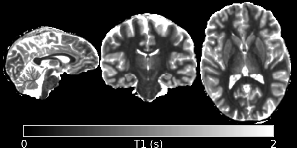
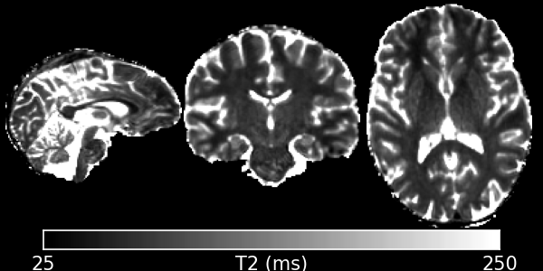
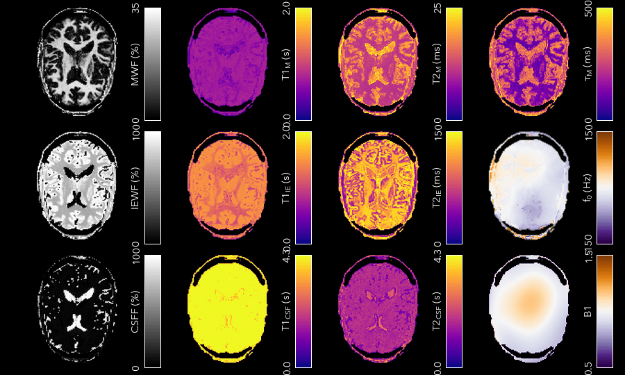

Relaxometry
===========

Relaxometry is the measurement of the longitudinal and transverse relaxation times T1 and T2. There are a multitude of different techniques for measuring both. The main focus of QUIT has been on the Driven-Equilibrium Single-Pulse Observation of T1 (DESPOT1) family of techniques, but the classic multi-echo T2 method and the more recent MP2RAGE T1 measurement method are also implemented, along with the AFI and DREAM B1 mapping methods.

The following programs are available:

* `qidespot1`_
* `qidespot1hifi`_
* `qidespot2`_
* `qidespot2fm`_
* `qimcdespot`_
* `qimultiecho`_
* `qimp2rage`_
* `qiafi`_
* `qidream`_

qidespot1
---------

This program implements the classic Driven Equilibrium Single-Pulse Observation of T1 (DESPOT1) algorithm, also known as the Variable Flip-Angle (VFA) method in the literature. This is a fast way to measure longitudinal relaxation using a spoiled steady-state sequence, which is know by a different name by every scanner manufacturer just to be helpful. On GE, it's SPoiled Gradient Recalled echo (SPGR), on Siemens it's Fast Low-Angle SHot (FLASH) and on Phillips the sequence is Fast Field Echo (FFE).

**Example Command Line**

.. code-block:: bash

    qidespot1 input_file.nii.gz --mask=mask_file.nii.gz --B1=b1_file.nii.gz < input.json

**Example Command Line**

.. code-block:: json

    {
        "SPGR": {
            "TR": 0.01,
            "FA": [3, 18]
        }
    }

**Outputs**

* ``D1_T1.nii.gz`` - The T1 map. Units are the same as those used for TR in the input.
* ``D1_PD.nii.gz`` - The apparent Proton Density map. No units.

*Important Options*

* ``--B1, -b``

    Specify an effective flip-angle or B1 map. This must be expressed as a fraction, e.g. a value of 1 in a voxel implies the nominal flip-angle was achieved.

* ``--algo, -a``

    This specifies which precise algorithm to use. There are 3 choices, classic linear least-squares (l), weighted linear least-squares (w), and non-linear least-squares (n). If you only have 2 flip-angles then LLS is the only meaningful choice. The other 2 choices should produce better (less noisy, more accurate) T1 maps when you have more input flip-angles. WLLS is faster than NLLS for the same number of iterations. However, modern processors are sufficiently powerful that the difference is bearable. Hence NLLS is recommended for the highest possible quality.

**References**

- `Christen et al, the original paper <http://pubs.acs.org/doi/abs/10.1021/j100612a022>`_
- `Chang et al, Weighted Least Squares Fitting <http://doi.wiley.com/10.1002/mrm.21669>`_
- `Wood, Optimum Flip-Angle Formulas <http://doi.wiley.com/10.1002/mrm.25592>`_

qidespot1hifi
-------------

This is an extension of DESPOT1 to fit a map simultaneously using an MP-RAGE / IR-SPGR type sequence. Although DESPOT1-HIFI can produce a rough estimate of B1, it often fails to produce reasonable values in the ventricles, and the fact that the MP-RAGE image is often acquired at lower resolution than the SPGR/FLASH data can also cause problems. Hence you should either smooth the B1 map produced as output, or fit it with a polynomial (:doc:`Utilities`), then recalculate T1 using the `qidespot1`_ program. Note that if your MP-RAGE image is not acquired at the same resolution as your SPGR data, it must be resampled to the same spacing before processing (and it should also be registered to your SPGR data).

**Example Command Line**

.. code-block:: bash

    qidespot1hifi spgr_file.nii.gz irspgr_file.nii.gz --mask=mask_file.nii.gz < input.json

**Example Command Line**

.. code-block:: json

    {
        "SPGR": {
            "TR": 0.01,
            "FA": [3, 18]
        },
        "MPRAGE": {
            "FA": 5,
            "TR": 0.01,
            "TI": 0.45,
            "TD": 0,
            "eta": 1,
            "ETL": 64,
            "k0": 0
        }
    }

For the MPRAGE sequence, the TR is the spacing between readouts/echoes, not the overall segment TR. TI is the Inversion Time, and TD is the Delay Time after the echo-train (often 0). Eta is the Inversion Efficiency, which should be set to 1. ETL is the Echo-Train Length - usually the number of phase encode steps in one segment. k0 defines the position in the echo-train that the center line of k-space is acquired. This is 0 for centric acquisition and ETL/2 for linear.

**Outputs**

* ``HIFI_T1.nii.gz`` - The T1 map. Units are the same as those used for TR in the input.
* ``HIFI_PD.nii.gz`` - The apparent Proton Density map. No units.
* ``HIFI_B1.nii.gz`` - The relative flip-angle map.

**References**

- `Original HIFI Paper <http://doi.wiley.com/10.1002/jmri.21130>`_

qidespot2
---------

DESPOT2 uses SSFP data and a separate T1 map to calculate T2, using the same maths as DESPOT1. It does not account for the banding artefacts present in SSFP data at field-strengths of 3T and above. See `qidespot2fm`_ for a method that does account for them, or if you have at least 4 phase-increments and complex data then see :doc:`SSFP` for a way to remove them before using this program.

**Example Command Line**

.. code-block:: bash

    qidespot2 t1_map.nii.gz input_file.nii.gz --mask=mask_file.nii.gz --B1=b1_file.nii.gz < input.json

**Example Command Line**

.. code-block:: json

    {
        "SSFP": {
            "TR": 0.005,
            "PhaseInc": [180],
            "FA": [12, 60]
        }
    }

Both ``PhaseInc`` and ``FA`` are measured in degrees. If the ellipse option is specified, then the sequence type must be ``SSFPGS``, which does not require a ``PhaseInc``. The units of ``TR`` must match the input T1 map.

**Outputs**

* ``D2_T2.nii.gz`` - The T2 map. Units are the same as those used for TR in the input.
* ``D2_PD.nii.gz`` - The apparent Proton Density map. No units. Will be corrected for T2 decay at the echo time.

*Important Options*

* ``--B1, -b``

    Specify an effective flip-angle or B1 map. This must be expressed as a fraction, e.g. a value of 1 in a voxel implies the nominal flip-angle was achieved.

* ``--algo, -a``

    This specifies which precise algorithm to use. There are 3 choices, classic linear least-squares (l), weighted linear least-squares (w), and non-linear least-squares (n). If you only have 2 flip-angles then LLS is the only meaningful choice. The other 2 choices should produce better (less noisy, more accurate) T1 maps when you have more input flip-angles. WLLS is faster than NLLS for the same number of iterations. However, modern processors are sufficiently powerful that the difference is bearable. Hence NLLS is recommended for the highest possible quality.

* ``--ellipse, -e``

    This specifies that the input data is the SSFP Ellipse Geometric Solution, i.e. that multiple phase-increment data has already been combined to produce band free images.

**References**

- `Original DESPOT2 Paper <http://doi.wiley.com/10.1002/mrm.10407>`_

qidespot2fm
-----------

DESPOT2-FM uses SSFP data with mulitple phase-increments (also called phase-cycles or phase-cycling patterns) to produce T2 maps without banding artefacts.

**Example Command Line**

.. code-block:: bash

    qidespot2fm t1_map.nii.gz input_file.nii.gz --mask=mask_file.nii.gz --B1=b1_file.nii.gz < input.json

The input file should contain all SSFP images concatenated together as a 4D file. The preferred ordering is flip-angle, then phase-increment (i.e. all flip-angles at one phase-increment, then all flip-angles at the next phase-increment).

**Example Command Line**

.. code-block:: json

    {
        "SSFP": {
            "TR": 0.005,
            "PhaseInc": [180, 180, 0, 0],
            "FA": [12, 60, 12, 60]
        }
    }

Both ``PhaseInc`` and ``FA`` are measured in degrees. The length of ``PhaseInc`` and ``FA`` must match.

**Outputs**

* ``FM_T2.nii.gz`` - The T2 map. Units are the same as those used for TR in the input.
* ``FM_PD.nii.gz`` - The apparent Proton Density map. No units. Will be corrected for T2 decay at the echo time.

*Important Options*

* ``--B1, -b``

    Specify an effective flip-angle or B1 map. This must be expressed as a fraction, e.g. a value of 1 in a voxel implies the nominal flip-angle was achieved.

* ``--asym, -A``

    With the commonly used phase-increments of 180 and 0 degrees, due to symmetries in the SSFP magnitude profile, it is not possible to distinguish positive and negative off-resonance. Hence by default ``qidespot2fm`` only tries to fit for positive off-resonance frequences. If you acquire most phase-increments, e.g. 180, 0, 90 & 270, then add this switch to fit both negative and positive off-resonance frequencies.

**References**

- `Orignal FM Paper <http://doi.wiley.com/10.1002/jmri.21849>`_

qimcdespot
----------

Multi-component DESPOT aims to separate SPGR and SSFP signals into multiple discrete pools with different T1 and T2. In the brain, the pool with shorter values is attributed to myelin water, while pools with longer values can be either intra/extra-cellular water or CSF.

It is recommended to have an off-resonance map to stabilise the fitting. This can be generated by using `qidespot1`_ and then `qidespot2fm`_ above. A B1 map is also essential for good results.

**Example Command Line**

.. code-block:: bash

    qimcdespot spgr_file.nii.gz ssfp_file.nii.gz --mask=mask_file.nii.gz --B1=b1_file.nii.gz --f0=f0_file.nii.gz --scale < input.json

The SSFP input file should contain all SSFP images concatenated together as a 4D file (see `qidespot2fm`_ above).

**Example Command Line**

.. code-block:: json

    {
        "Sequences": [
            {
                "SPGR": {
                    "TR": 0.01,
                    "FA": [3,4,5,7,9,12,15,18]
                }
            },
            {
                "SSFP": {
                    "TR": 0.05,
                    "FA": [12,16,20,24,30,40,50,60,12,16,20,24,30,40,50,60],
                    "PhaseInc": [180,180,180,180,180,180,180,180,0,0,0,0,0,0,0,0]
                }
            }
        ]
    }

The order that the sequences are listed must match the order the input files are specified on the command-line.

**Outputs**

Note - the output prefix will change depending on the model selected (see below). The outputs listed here are for the 3 component model.

* ``3C_T1_m.nii.gz`` - T1 of myelin water
* ``3C_T2_m.nii.gz`` - T2 of myelin water
* ``3C_T1_ie.nii.gz`` - T1 of intra/extra-cellular water
* ``3C_T2_ie.nii.gz`` - T2 of intra/extra-cellular water
* ``3C_T1_csf.nii.gz`` - T1 of CSF
* ``3C_T2_csf.nii.gz`` - T2 of CSF
* ``3C_tau_m.nii.gz`` - The residence time of myelin water (reciprocal of forward exchange rate)
* ``3C_f_m.nii.gz`` - The Myelin Water Fraction (MWF)
* ``3C_f_csf.nii.gz`` - The CSF Fraction
* ``3C_f0.nii.gz`` - The off-resonance frequency. If this was specified on the command line, it will be a copy of that file
* ``3C_B1.nii.gz`` - The relative flip-angle map. If this was specified on the command line, it will be a copy of that file

The intra/extra-cellular water fraction is not output, as it is not a free parameter (only 2 of the 3 pool fractions are required for the calculations). It is easy to calculate this post-hoc by subtracting the MWF and CSFF from 1.

*Important Options*

* ``--algo, -a``

    * S - Stochastic Region Contraction
    * G - Gaussian Region Contraction
    
    Gaussian is recommended.

* ``--tesla, -t``

    Specify the field-strength so sensible fitting ranges can be used. Currently only ranges for (3) and (7)T are defined. If you wish to specify your own ranges, set this option as (u) and then the ranges will be read from your input file.

* ``--model, -m``
    * 1 - 1 component model (no fractions, just a single T1/T2)
    * 2 - 2 component model. Myelin and intra/extra-cellular water
    * 2nex - 2 component model without exchange
    * 3 - 3 component model. Myelin water, IE water & CSF
    * 3nex - 3 component model without exchange
    * 3f0 - 3 component model, allow an additional off-resonance offset between myelin and IE water pools

**References**

- `Original mcDESPOT paper <http://doi.wiley.com/10.1002/mrm.21704>`_
- `3 component model <http://doi.wiley.com/10.1002/mrm.24429>`_
- `Stochastic/Gaussian Region Contraction <http://doi.wiley.com/10.1002/mrm.25108>`_

qimp2rage
---------

MP2RAGE adds a second inversion time to the standard T1w MPRAGE sequence. Combining the (complex) images with the expression :math:`S_1 S_2^*/(|S_1^2 + S_2^2|)` produces a real-valued image that is corrected for receive coil (B1-) inhomogeneity. In addition, if the two inversion times are carefully selected, a one-to-one mapping exists between the values in that image and T1, which is also robust to transmit (B1+) inhomogeneity. Finally, as the two images are implicitly registered, this method has several advantages over DESPOT1.

**Example Command Line**

.. code-block:: bash

    qimp2rage input_file.nii.gz --mask=mask_file.nii.gz < input.json

The input file must be complex-valued.

**Example Command Line**

.. code-block:: json

    {
        "MP2RAGE" : {
            "TR" : 0.006,
            "TRPrep" : 5,
            "TI" : [0.9, 2],
            "SegLength" : 128,
            "k0" : 64,
            "FA": [6, 8]
        }
    }

``TR`` is the readout or acquisition repetition time, while ``TRPrep`` is time between preparations/inversion pulses. ``SegLength`` is the number of readouts in one segment, and ``k0`` is the index within the segment when the center line of k-space is read. This is 0 for centric order, or :math:`SegLength / 2` for linear (default Siemens) order. There should be two values of ``TI`` and ``FA``.

**Outputs**

* ``{input}_contrast.nii.gz`` - The MP2 contrast image. The range of this image is -0.5 to 0.5.
* ``{input}_T1.nii.gz`` - The T1 map. Units are the same as `TR` and `SegTR`.

*Important Options*

* ``--beta, -b``

    Regularisation factor for robust contrast calculation (see references). It is recommended to experiment with this parameter to manually find an optimum value, which should then be kept constant for an entire dataset. 

**References**

- `Original MP2RAGE paper <https://www.sciencedirect.com/science/article/pii/S1053811909010738>`_
- `Robust contrast <https://journals.plos.org/plosone/article?id=10.1371/journal.pone.0099676>`_

qimultiecho
-----------

Classic monoexponential decay fitting. Can be used to fit either T2 or T2*.

**Example Command Line**

.. code-block:: bash

    qimultiecho input_file.nii.gz --algo=a < input.json

**Example Command Line**

For regularly spaced echoes:

.. code-block:: json

    {
        "MultiEcho" : {
            "TR" : 2.5,
            "TE1" : 0.005,
            "ESP" : 0.005,
            "ETL" : 16
        }
    }

``TE1`` is the first echo-time, ``ESP`` is the subsequent echo-spacing, ``ETL`` is the echo-train length.

For irregularly spaced echoes:

.. code-block:: json

    {
        "MultiEchoFlex" : {
            "TR" : 2.5,
            "TE" : [0.005, 0.01, 0.03, 0.05]
        }
    }

.. note::

    The current implementation of the ARLO method will only work with regularly spaced echoes

**Outputs**

* ``ME_T2.nii.gz`` - The T2 map. Units are the same as `TE1` and `ESP`.
* ``ME_PD.nii.gz`` - The apparent proton-density map (intercept of the decay curve at TE=0)

*Important Options*

* ``--algo, -a``

    * l - Standard log-linear fitting
    * a - ARLO (see reference below)
    * n - Non-linear fitting

**References**

- `ARLO <http://doi.wiley.com/10.1002/mrm.25137>`_

qiafi
-----

Calculates a relative flip-angle (B1) map using the Actual Flip-angle Imaging method.

**Example Command Line**

.. code-block:: bash

    qiafi input_file.nii.gz

Does not read any input from ``stdin``. The input file should contain two volumes, corresponding to TR1 and TR2.

**Outputs**

* ``AFI_B1.nii.gz`` - The relative flip-angle map.

*Important Options*

* ``--flip, -f``

    The nominal flip-angle that should have been achieved, default 55 degrees.

* ``--ratio, -r``

    The ratio of TR2 to TR1, default 5.

* ``--save, -s``

    Output AFI_angle.nii.gz, the actual achieved angle in each voxel.

**References**

- `Original AFI Paper <http://doi.wiley.com/10.1002/mrm.21120>`_
- `Optimal parameters <http://doi.wiley.com/10.1002/mrm.22394>`_
- `Steady-State Conditions <http://doi.wiley.com/10.1002/mrm.21592>`_

qidream
-------

Calculates a relative flip-angle (B1) map using the DREAM method.

**Example Command Line**

.. code-block:: bash

    qidream input_file.nii.gz

Does not read any input from `stdin`. The input file should contain two volumes, the FID and stimulated echo (STE).

**Outputs**

* ``DREAM_B1.nii.gz`` - The relative flip-angle map.
* ``DREAM_angle.nii.gz`` - The actual achieved angle in each voxel.

*Important Options*

* ``--alpha, -a``

    The nominal flip-angle that should have been achieved, default 55 degrees.

* ``--order, -O``

    * f - FID is the first volume, STE is second
    * s - STE is the first volume, FID is second
    * v - VST (Virtual Stimulated Echo) is the first volume, FID is second

**References**

- `Original DREAM Paper <http://doi.wiley.com/10.1002/mrm.24158>`_
- `Virtual Stimulated Echo <http://doi.wiley.com/10.1002/mrm.24667>`_
