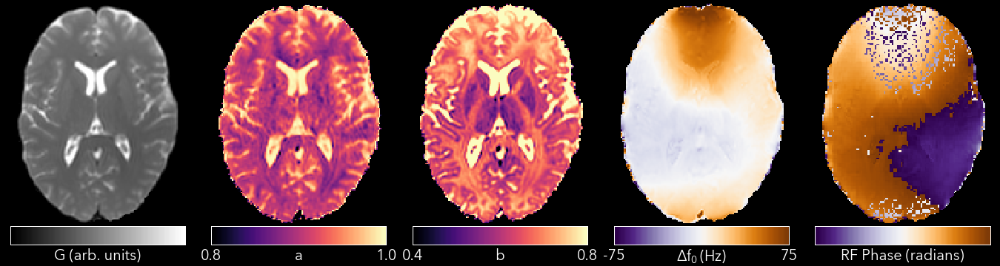

# SSFP

The Steady-State Free-Precession (SSFP), or more precisely balanced-SSFP (bSSFP), sequence is one of the oldest NMR sequences and can be used to give high SNR MR images with mixed T1/T2 contrast in very short scan time. However, it suffers from banding artefacts in areas of off-resonance which limit its clinical applicability. This module contains a tool for removing those banding artefacts, and then further tools for quantitative mapping using the ellipse signal model.

* [qi_ssfp_bands](#qi_ssfp_bands)
* [qi_ssfp_ellipse](#qi_ssfp_ellipse)
* [qi_ssfp_planet](#qi_ssfp_relax)
* [qi_ssfp_emt](#qi_ssfp_emt)

## qi_ssfp_bands

There are several different methods for removing SSFP bands in the literature. Most of them rely on acquiring multiple SSFP images with different phase-increments (also called phase-cycling or phase-cycling patterns). Changing the phase-increments moves the bands to a different location, after which the images can be combined to reduce the banding. The different approaches are discussed further below, but the recommended method is the Geometric Solution which requires complex data.

**Example Command Line**

```bash
qissfpbands ssfp.nii.gz --method=G --2pass --magnitude
```

The SSFP file must be complex-valued to use the Geometric Solution or Complex Average methods. For the other methods magnitude data is sufficient. Phase-increments should be in opposing pairs, e.g. 180 & 0 degrees, 90 & 270 degrees. These should either be ordered in two blocks, e.g. 180, 90, 0, 270, or alternating, e.g. 180, 0, 90, 270.

**Outputs**

The output filename is the input filename with a suffix that will depend on the method selected (see below).

**Important Options**

- `--method`

    Choose the band removal method. Choices are:

    - `G` Geometric solution. Suffix will be `GSL` or `GSM`
    - `X` Complex Average. Suffix will be `CS` (for Complex Solution)
    - `R` Root-mean-square. Suffix will be `RMS`
    - `M` Maximum of magnitudes. Suffix will be `Max`
    - `N` Mean of magnitudes. Suffix will be `MagMean`

- `--regularise`

    The Geometric Solution requires regularisation in noisy areas. Available methods are:

    - `M` Magnitude regularisation as in original paper
    - `L` Line regularisation (unpublished)
    - `N` None

    The default is `L`. If `L` or `M` are selected, then that character will be appended to the suffix.

- `--2pass, -2`

    Apply the second-pass energy-minimisation filter from the original paper. Can be likened to smoothing the phase data. If selected will append `2` to the suffix.

- `--alt-order`

    Phase-increments alternate, e.g. 180, 0, 90, 270. The default is the opposite (two blocks), e.g. 180, 90, 0, 270.

- `--ph-incs`

    Number of phase-increments. The default is 4. If you have multiple phase-increments and (for example) multiple flip-angles, `qissfpbands` can process them all in one pass.

- `--ph-order`

    The data order is phase-increment varying fastest, flip-angle slowest. The default is the opposite.

**References**

- [Geometric Solution](http://doi.wiley.com/10.1002/mrm.25098)

## qi_ssfp_ellipse

The most important result of Xiang & Hoff's Geometric Solution paper was that the SSFP signal equation can be expressed as an ellipse in the complex-plane. Shcherbakova built on this and showed it was possible to recover the ellipse parameters \(G, a, b\) from at least six phase-increments. They then proceeded to recover \(T_1 & T_2\) from the ellipse parameters. This utility calculates the ellipse parameters, and `qi_ssfp_planet` then processes those parameters to calculate \(T_1 & \T_2\)



**Example Command Line**

```bash
qi_ssfp_ellipse ssfp_data.nii.gz < input.json
```

The SSFP file must be complex-valued. At least three pairs of opposing phase-increments are recommended (six images in total).

**Outputs**

- `ES_G` - The Geometric Solution point of the ellipse. Influences the overall size of the ellipse. This is called \(M\) in the Hoff and Shcherbakova papers, but it is not a measurable magnetization and hence to distinguish it a different letter is used.
- `ES_a` - The ellipse parameter that along with \(G\) controls the ellipse size.
- `ES_b` - The ellipse parameter that determines how flat or circular the ellipse is.
- `ES_theta_0` - The accrued phase due to off-resonance (divide by \(2\pi TE\=\pi TR\) to find the off-resonance frequency).
- `ES_phi_rf` - The effective phase of the RF pulse.

**Important Options**

- `--algo, -a`

    There are two available methods for calculating the ellipse parameters

    - `h` Hyper-Ellipse method, similar to that used in the Shcherbakova paper. Can fail when \(\alpha\) falls below the Ernst angle, where there is an inversion of the ellipse properties.
    - `d` Direct non-linear fitting of the data, which does not suffer the above properties. The default.

**References**

- [PLANET](http://dx.doi.org/10.1002/mrm.26717)
- [Hyper-Ellipse](http://linkinghub.elsevier.com/retrieve/pii/S0167947310004809)

## qi_ssfp_planet

Converts the SSFP Ellipse parameters into relaxation times.

**Example Command Line**

```bash
qi_ssfp_planet ES_G.nii.gz ES_a.nii.gz ES_b.nii.gz
```

**Outputs**

- `PLANET_T1.nii.gz` - Longitudinal relaxation time
- `PLANET_T2.nii.gz` - Transverse relaxation time
- `PLANET_PD.nii.gz` - Apparent Proton Density

**References**

- [PLANET](http://dx.doi.org/10.1002/mrm.26717)

## qi_ssfp_emt

Due to the short \(TR\) commonly used with SSFP, at high flip-angles the sequence becomes MT weighted. It is hence possible to extract qMT parameters from SSFP data. More details will be in a forthcoming paper.

**Example Command Line**

```bash
qi_ssfp_emt ES_G.nii.gz ES_a.nii.gz ES_b.nii.gz
```

**Outputs**

- `EMT_T1f.nii.gz` - Longitudinal relaxation time of the free water bool
- `EMT_T2f.nii.gz` - Transverse relaxation time of the free water pool
- `EMT_M0.nii.gz` - Apparent Proton Density
- `EMT_F.nii.gz`- Bound pool fraction
- `EMT_kf.nii.gz` - Forward exchange rate

**References**

- [Bieri et al](http://doi.wiley.com/10.1002/mrm.21056)
- [Gloor et al](http://doi.wiley.com/10.1002/mrm.21705)
